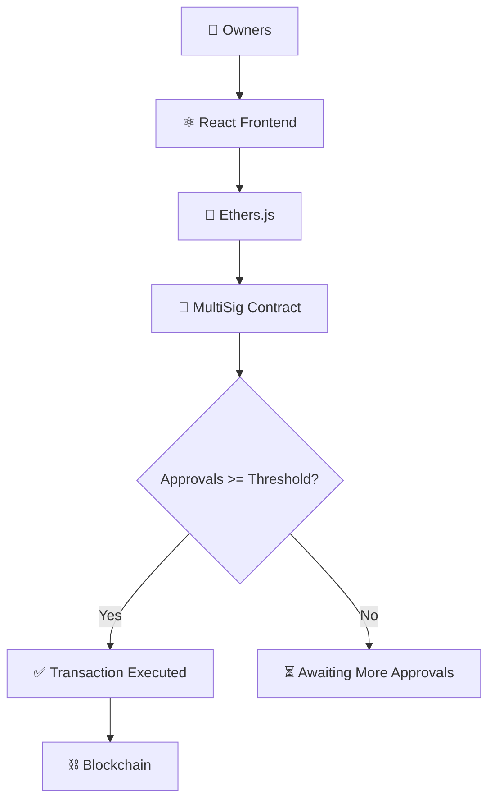

<div align="center">

# 🔐 MultiSig Wallet

**A multi-signature wallet requiring collective approval before any transaction executes**


</div>

---

## 📑 Table of Contents

- [Overview](#-overview)
- [Features](#-features)
- [Tech Stack](#-tech-stack)
- [Architecture](#-architecture)
- [Smart Contract Functions](#-smart-contract-functions)
- [Getting Started](#-getting-started)
- [Learning Outcomes](#-learning-outcomes)
- [Future Improvements](#-future-improvements)
- [Author](#-author)

---

## 📖 Overview

**MultiSig Wallet** is a decentralized wallet system that requires **multiple owner approvals** before any transaction can be executed. The project demonstrates how organizations and teams can secure digital assets using multi-signature authorization.

By eliminating single-point-of-failure risks, this wallet models the security patterns used by protocols, DAOs, and institutional crypto custody solutions.

---

## ✨ Features

| Feature | Description |
|---|---|
| 👥 Multiple Wallet Owners | Wallet is jointly controlled by N owners |
| 📤 Submit Transactions | Any owner can propose a new transaction |
| ✅ Approve Transactions | Owners vote to approve pending transactions |
| ⚙️ Execute Transactions | Transaction executes once approval threshold is met |
| 🔐 Multi-Signature Security | No single owner can move funds unilaterally |
| ⛓️ Blockchain-Based Management | All approvals and executions recorded on-chain |

---

## 🛠 Tech Stack

| Layer | Technologies |
|---|---|
| **Frontend** | React, JavaScript, Ethers.js |
| **Blockchain** | Solidity, Hardhat, Ethereum |

---

## 🏗 Architecture



---

## 📜 Smart Contract Functions

| Function | Type | Description |
|---|---|---|
| `submitTransaction()` | Write | Proposes a new transaction for owner approval |
| `approveTransaction()` | Write | Records an owner's approval for a pending transaction |
| `executeTransaction()` | Write | Executes a transaction once the approval threshold is met |

```solidity
function submitTransaction(address _to, uint256 _value) public onlyOwner {
    transactions.push(Transaction(_to, _value, false, 0));
}

function approveTransaction(uint256 _txId) public onlyOwner {
    require(!approved[_txId][msg.sender], "Already approved");
    approved[_txId][msg.sender] = true;
    transactions[_txId].approvals += 1;
}

function executeTransaction(uint256 _txId) public onlyOwner {
    Transaction storage txn = transactions[_txId];
    require(txn.approvals >= required, "Not enough approvals");
    require(!txn.executed, "Already executed");
    txn.executed = true;
    payable(txn.to).transfer(txn.value);
}
```

---

## 🚀 Getting Started

### Prerequisites
- Node.js (v16+)
- MetaMask browser extension
- Hardhat

### Installation

```bash
# Clone the repository
git clone https://github.com/Jeevan9898/multisig-wallet.git
cd multisig-wallet

# Install dependencies
npm install

# Compile the smart contract
npx hardhat compile

# Start a local blockchain
npx hardhat node

# Deploy the contract
npx hardhat run scripts/deploy.js --network localhost

# Start the frontend
cd frontend
npm install
npm start
```

---

## 🎓 Learning Outcomes

- Smart Contract Security
- Multi-Signature Authorization
- Transaction Approval Workflows
- Blockchain Governance Concepts
- Secure Wallet Design

---

## 🔮 Future Improvements

- [ ] Dynamic Owner Management
- [ ] Transaction History
- [ ] Timelock Features
- [ ] DAO Integration

---

## 👤 Author

**Jeevan Yadav**

[](https://jeevan-yadav.vercel.app/)
[](https://github.com/Jeevan9898)
